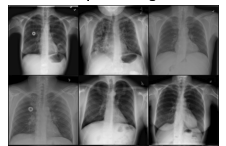
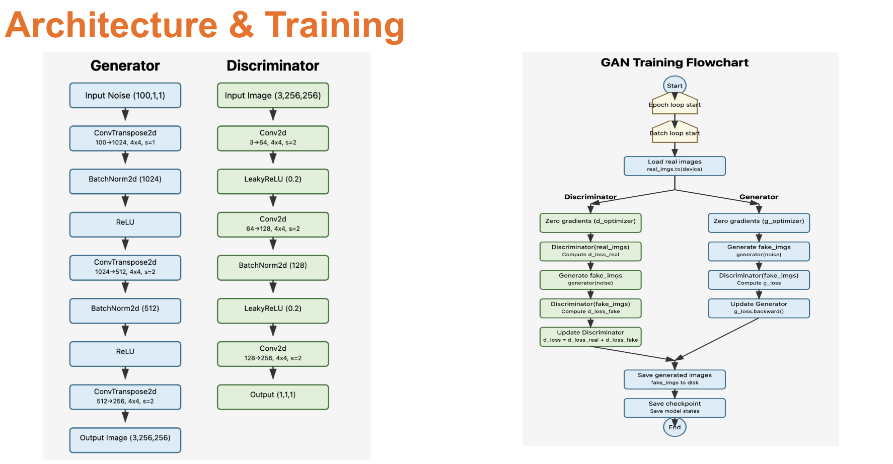
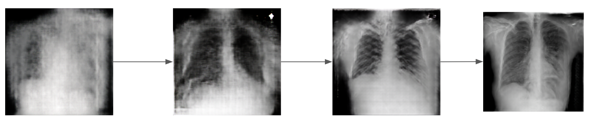
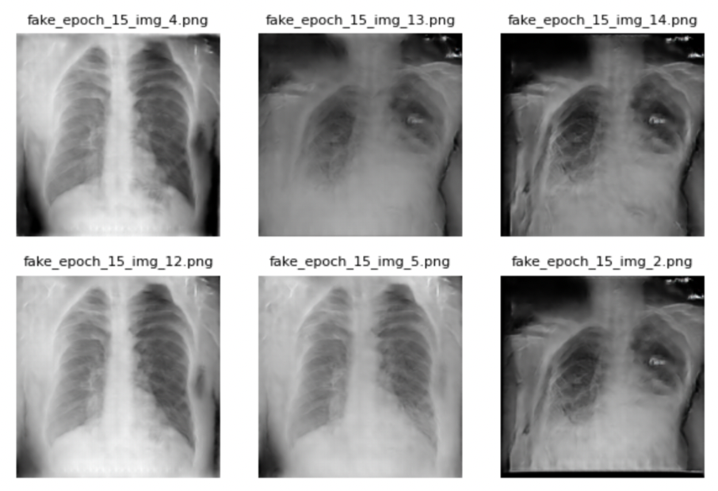

# Synthetic Medical Data Generation using GAN

This repository provides a framework for generating synthetic chest X-ray images using Generative Adversarial Networks (GANs). It targets two classes from the NIH Chest X-ray14 dataset - “No Finding” and “Infiltration” and includes evaluation through a ResNet-based classification pipeline. The goal is to address challenges in medical data availability, such as class imbalance and privacy constraints, by supplementing training data with synthetic images.

---

## 📌 Objective

Medical AI models require large, diverse, and balanced datasets. However, real-world medical data often suffers from:

- **Privacy concerns**
- **Label imbalance**
- **Limited access to rare condition samples**

This project employs GANs to generate synthetic images that closely resemble real chest X-rays, offering a privacy-preserving and scalable solution for data augmentation.

---

## 🗂️ Repository Structure

- `gan no finding.ipynb`: Trains a GAN to generate synthetic “No Finding” (normal) chest X-rays.
- `gan infiltration.ipynb`: Trains a GAN to generate synthetic “Infiltration” chest X-rays.
- `classification.ipynb`: Evaluates model performance using real vs. real+synthetic datasets via a ResNet-18 classifier.

---

## 🧾 Dataset

A curated subset of the NIH Chest X-ray14 dataset is used containing the classes:
- No Finding
- Infiltration

All images are preprocessed to a size of 256×256 pixels and normalized for stable GAN training.

**Figure 1:** Sample real X-ray images from the dataset

---

## 🧠 GAN Architecture & Training Procedure

The architecture follows a Deep Convolutional GAN (DCGAN) structure, with specific modifications for medical imaging. The training loop alternates between updating the discriminator and the generator using adversarial loss.

**Figure 2:** Generator and Discriminator architecture (left); GAN training workflow (right)

### Image Quality Progression During Training

**Figure 3:** Visual progression of generated images across epochs. Noticeable improvements in realism and sharpness as training advances.

---

## 🖼️ Synthetic Image Samples

The generator produces increasingly realistic X-rays by epoch 15. Below are synthetic samples generated for the “Infiltration” class.

**Figure 4:** Synthetic chest X-rays generated at epoch 15

---

## 📊 Evaluation via Classification

To evaluate the usefulness of synthetic data, a ResNet-18 classifier is trained and tested under two settings:

1. Only real training data
2. Real + synthetic training data (augmentation)

### Evaluation Protocol:
- Test accuracy reported on a held-out test set
- Image Generation Metrics
- Visual Assessment
---

## 🧪 Results

| Dataset Used             | Test Accuracy (%) |
|--------------------------|-------------------|
| Real Data Only           | 70.46              |
| Real + Synthetic (GAN)   | 72.24              |

**Table 1:** Classification performance comparison. Augmenting the dataset with GAN-generated images improved the accuracy.

| Metrics            | Score |
|--------------------------|-------------------|
| FID           | 164.1182              |
| Inception Score   | 2.3883              |
---
**Table 2:** Image Generation Metrics.

